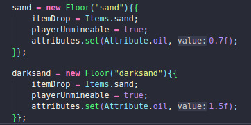
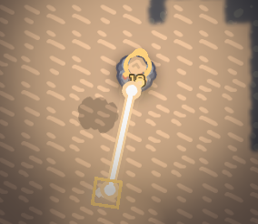
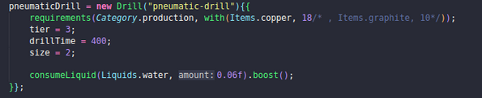
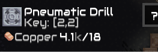
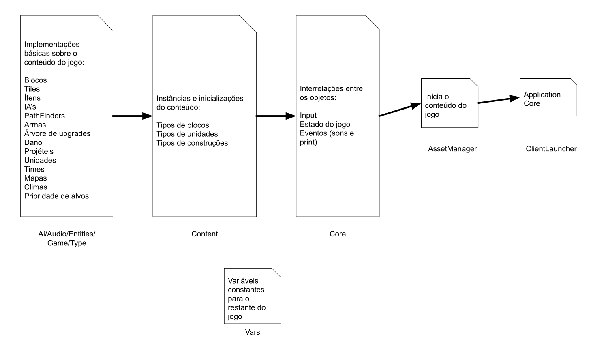

# t5 Explorando o código de Mindustry
t5-2022a-flavio-mindustry created by GitHub Classroom

Mindustry é um jogo Tower Defense open source feito em Java. Nele, no modo campanha, o objetivo do jogador é dominar todas as áreas de um planeta as quais estão infestadas de outros inimigos. Para tal, o jogo oferece uma série de blocos de construção, alguns de defesa, como muros; outros de ataque, como torretas; brocas para explorar recursos, como cobre; construções de produção, como prensas que transformam carvão em grafite.

# Itens do Jogo

A classe para os blocos (Block) é definida no pacote mindustr.world e define todo o tipo de comportamento possível de um bloco dentro do jogo, desde construções até o cenário. Por isso é uma classe bem grande, contém atributos que servem ao propósito de todo tipo: controla se o bloco gera algum tipo de líquido, se consome energia, se pode ser destruído, se absorve tiros etc.

As dezenas de classes filhas da classe Block são instanciadas na classe Blocks, onde todos os blocos possíveis são inicializados. Se você quer fazer com que tudo custe 0 recursos no jogo, é aqui que se tem que mexer. A classe Blocks mantém estes objetos como atributos públicos com tudo o que se precisa já definido:

- É definido o tamanho do bloco no mapa;
- O seu HP;
- Para construções, o seu custo em recursos (método requirements);
- Para blocos que geram itens, o seu output, o tempo em que gera, os itens de entrada e a energia que consome;
- Para blocos de recursos, o tipo de item;
- Para alguns solos do mapa, o item ou líquido que ele dropa (água/areia);
- Se o bloco emite luz;
- Para torretas de defesa, define uma arma, o tipo de munição que pode receber, a velocidade e o tipo do tiro;

A lógica que existe entre a classe Block e Blocks se repete para praticamente todo o resto de classes:

- Há uma classe Item para os recursos, e uma classe Items, que determina como é cada recurso: a sua explosividade, dureza, inflamabilidade, radioatividade etc.
- Há uma classe Liquid para líquidos, e uma classe Liquids, que determina como é cada líquido: a sua viscosidade, temperatura etc.
- Há uma classe UnityType para as unidades, e uma classe UnityTypes, que determina como é cada unidade: a sua velocidade, a sua arma, seu projétil, a sua IA etc.

Esta grande quantidade de classes que precisam acessar atributos de outras classes cria uma grande complexidade no programa e talvez por isso tenha se optado por manter os atributos sempre públicos. Sei que não é uma boa ideia, mas é o que foi feito aqui.

Por exemplo, para setar o preço de algo se faz apenas Items.(nome do item), não havendo nenhum método get(). Isso é possível porque os atributos da classe Items são estáticos, não necessitando que um objeto seja criado.

Talvez por isso, sempre que um novo objeto é instanciado uma sintaxe curiosa é utilizada:



**A classe Floor é filha da classe Block

**itemdrop define o que pode ser minerado do local

**playerUnmineable define se o player consegue minerar o bloco, ou se precisa utilizar uma construção (broca)

**attributes tem um array que mantém a relação do bloco com outros blocos, nesse caso, está definindo que areia e óleo são relacionados.

Isso é chamado de instance initializer block e funciona desde que os atributos da classe não sejam privados. De certa forma, esta sintaxe é um atalho, que economiza a repetição do nome da classe para todas os atributos:

```
sand = new Floor(“sand”);
sand.itemDrop = Items.sand;
sand.playerUnmineable = true;
sand.attributes.set(Attribute.oil, 0.7f);
```

Este tipo de inicialização é equivalente a chamar àquele bloco após o super() dentro do construtor da classe:

```

obj = new Class(){
  a = 1
}

// Acontece isso:

class Class{
  public int a;

  public Class(){
    super();
    {a = 1};
  }
}

```

# Mudando alguns atributos

Alterando o atributo playerUnmineable do objeto sand para false, o player pode minerar areia:



A broca pneumática custa grafite, o que é um pouco chato, vamos remover isso:



E no jogo:



# Loaders e Core

Na classe principal do jogo, a ClientLauncher, é feito o uso de um objeto chamado assets da classe AssetManager. Esta classe permite unir todos os assets do jogo, todos os itens sendo usados, texturas, fontes, efeitos sonoros, músicas etc. 

Através da função setLoader() esta classe recebe uma série de classes anônimas que gerenciam as músicas e sons, mas em especial recebe uma classe chamada ContentLoader.

A classe ContentLoader é responsável por manter a iniciação de todos os objetos citados anteriormente: ela chama as funções que iniciam todos os blocos e etc. ContentLoader pertence a um package chamado mindustry.core, onde se encontram as classes que englobam os acontecimentos dentro do jogo:

Por exemplo, a classe Control implementa um ApplicationListener para os eventos de input: aqui é determinado que quando o jogador aperta no botão de play, o jogo começa; que quando um mapa é carregado, a câmera deve ser centralizada no core; que quando uma onda de inimigos spawnar, o efeito sonoro apropriado deve tocar.

A classe GameState mantém o estado do jogo, setado inicialmente como menu. Aqui ficam os contadores de hordas de inimigos, se algum time venceu ou não algum jogo competitivo, as regras do mapa. Os estados do jogo podem ser de menu, jogando ou pausado.

A classe Logic também é um ApplicationListener, mas desta vez para os blocos, condições do mapa, captura de um setor/mapa, contruções de blocos (a sua quantidade, cópias dos objetos já setados na classe Blocks e as suas posições), a destrução de unidades etc.

A classe Renderer mantém os métodos de como renderizar os objetos no jogo, desde os planetas, blocos até líquidos que vazam no chão. Para isso o jogo possui um pacote mindustry.graphics, os quais alguns são já determinados na classes que englobam as inicialização dos objetos (como a classe Blocks), determinando que se alguma tubulação está terminando sem entrar em alguma construção, é preciso renderizar o líquido vazando.


# Overview

Tudo o que foi dito é bastante superficial quanto ao funcionamento do código. Muitas classes para mods e conexão com a Internet não foram citasdas por conta do já grande tamanho de código que existe a ser analisado. Boa parte do código por si só talvez se prove bem confusa. Os comentário no código mesmo às vezes são comicos do tipo "esta parte jamais será executada" após um tratamentos de erro. 

Há também tratamentos de versões antigas, para construções que não existem mais no jogo, como o CommandCenter. E várias supressões de warnings através de "@SupressWarnings".

De qualquer forma, a ideia geral da relação entre as classes e pacotes não se mostra tão complexa. Talvez por ter muitos atributos públicos algumas relações fiquem mais simples, embora isso não seja recomendado. Como já dito, toda a parte de inicialização dos objetos do jogo, como inimigos, contruções e torretas envolve buscar atributos estáticos de outras classes através de Class.attr.

Resumidamente, as relações do jogo se seguem na imagem a seguir. Não é, obviamente um diagrama de classes (até porque existem mais de 600 delas), mas dá uma ideia geral do funcionamento do programa:


